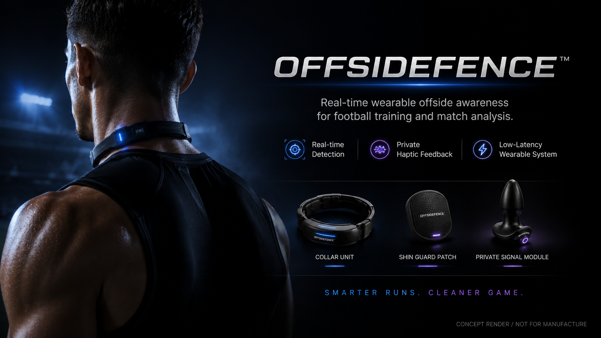

# OffsideFence™ — Tactical Behavior Correction System for Forwards

> **Let every run happen where it should.**

[](#status)
[](#ethics)
[](LICENSE)
[](#acknowledgements)

<p align="center">
  
</p>

**OffsideFence** is a concept demonstrator for a forward-facing wearable that uses real-time computer vision to detect offside positions on the pitch and delivers **Haptic Tactical Correction** (民间说法: "电一下") the instant a forward strays beyond the last defender.

This repository is a **concept artifact**, not a product, not a startup, not a fork of any commercial system. It exists as part of a single-shot content project to explore the boundary between "what computer vision can already do for football" and "what we should or shouldn't strap to a player's body."

---

## What this is

A 58-second product launch, designed to look real enough that an audience of engineers and sports-tech practitioners has to stop and ask:

> *"Wait, is this actually a thing?"*

That moment of doubt is the deliverable. Everything in this repository is engineered to maximize that signal — naming, terminology, architecture diagrams, protocol specifications, terminology consistency — without crossing the line into "this is a manufacturable product."

## What this is not

- ❌ Not a product. We are not making this. We are not raising funding. We are not taking pre-orders.
- ❌ Not a fork or commercial derivative of Roboflow. Roboflow is referenced as a technology backbone, not a partnership.
- ❌ Not a complete runnable system. The `src/` tree contains protocol stubs and reference function signatures, not an end-to-end pipeline.
- ❌ Not a series. There is one video. There is one launch. There is no IP expansion.
- ❌ Not a critique of VAR. It is a fictional hardware layer that *invents a problem VAR doesn't have*.

If you arrived here from a video or social post and want to know whether this is real: **[please read this first →](docs/why-this-is-fiction.md)**

---

## Architecture (concept overview)

```
┌──────────────────────────────────────────────────────────────────────┐
│                          Broadcast Feed                              │
│                    (multi-camera · 50p · 1080p)                      │
└──────────────────────────────┬───────────────────────────────────────┘
                               │ RTSP / SRT
                               ▼
┌──────────────────────────────────────────────────────────────────────┐
│              Pitch Perception Layer (edge · on-prem)                │
│  ┌────────────────────┐  ┌────────────────────┐  ┌────────────────┐  │
│  │  Player Detection  │  │   Pitch Keypoints  │  │  Homography    │  │
│  │  (Roboflow Sports) │  │  (Roboflow Sports) │  │   (OpenCV)     │  │
│  └─────────┬──────────┘  └─────────┬──────────┘  └────────┬───────┘  │
│            └────────────┬──────────┘                       │          │
│                         ▼                                  │          │
│              ┌──────────────────────┐                      │          │
│              │  Tactical State      │◀─────────────────────┘          │
│              │  Engine (offside)    │                                 │
│              └──────────┬───────────┘                                 │
│                         │ decision packet (≤80ms)                     │
└─────────────────────────┼────────────────────────────────────────────┘
                          ▼
┌──────────────────────────────────────────────────────────────────────┐
│                 Haptic Tactical Correction (collar)                  │
│  ┌─────────────┐   ┌─────────────┐   ┌─────────────┐                 │
│  │  Training   │   │   Match     │   │  Darwin /   │                 │
│  │   Mode      │   │   Mode      │   │  Inzaghi    │                 │
│  │  (gentle)   │   │  (firm)     │   │  Legacy     │                 │
│  └─────────────┘   └─────────────┘   └─────────────┘                 │
│                          ▲                                           │
│                          │ encrypted backchannel                     │
│  ┌───────────────────────┴──────────────────────────┐                │
│  │         Coaching Tablet / Bench Display          │                │
│  └──────────────────────────────────────────────────┘                │
└──────────────────────────────────────────────────────────────────────┘
```

**Reference implementation** lives in [`src/`](src/) as protocol stubs and decision function signatures. The pipeline is real (Roboflow sports publishes the underlying models), the hardware layer is fiction, the integration is deliberately incomplete.

For the full system specification, see [`docs/architecture.md`](docs/architecture.md).
For the white paper (arXiv-style), see [`white-paper.pdf`](white-paper.pdf).
For the protocol that the collar would speak, see [`spec/ofp-protocol.md`](spec/ofp-protocol.md).

---

## Operating modes

| Mode | Behavior | Target user |
|------|----------|-------------|
| **Training** | Single short pulse at 200ms latency threshold. Low intensity. | Academy coaches running repetition drills. |
| **Match** | Decision-validated haptic feedback, no false positive > 0.5%. | Professional clubs under broadcast. |
| **Darwin** | Adaptive intensity curve; intensity tracks repeat-offense count in a match. | Coaches studying opponent tendency build-up. |
| **Inzaghi Legacy** | No feedback. The collar stays silent. The forward is left to commit the same offside for the seventh time, on purpose, in memoriam. | Statues, museums, and that one Champions League final. |

Mode specifications, decision thresholds, and intensity curves: [`docs/mode-specs.md`](docs/mode-specs.md).

---

## The "民间说法"

In Chinese football fan culture, the hardware layer of OffsideFence has already been nicknamed:

> **"电一下"** — *literally: "a small shock"*

This is not a marketing term. It is the term that fans will reach for in the comments section, because it captures what the device *would* do, with a hint of the moral judgment the device *should not* make. We use it here in the same way a translation note uses an untranslatable word: as evidence that the joke is doing cultural work the press kit cannot.

**The press kit term is `Haptic Tactical Correction`. The forum term is `电一下`. The collar is the same.**

---

## Status

This repository was published on **2026-06-15** as a single-shot concept artifact. It is complete in the sense that the concept is fully specified; it is intentionally incomplete in the sense that no further commits are planned.

| Component | State |
|-----------|-------|
| Concept specification | ✅ Final |
| Architecture diagram | ✅ Final |
| Operating modes | ✅ Final (4 of 4) |
| White paper (arXiv-style, 8 pages) | ✅ Final — [`white-paper.pdf`](white-paper.pdf) |
| Reference protocol (`OFP/0.1`) | ✅ Final — [`spec/ofp-protocol.md`](spec/ofp-protocol.md) |
| Reference source stubs | ✅ Stubs only, not a runnable system |
| Engineering roadmap | ❌ None. There is no roadmap. |
| Press kit | ✅ [`docs/press-kit.md`](docs/press-kit.md) |
| Ethics & boundary statement | ✅ [`docs/ethics.md`](docs/ethics.md) |
| Why this is fiction | ✅ [`docs/why-this-is-fiction.md`](docs/why-this-is-fiction.md) |

---

## Acknowledgements

The pitch perception layer is built conceptually on top of [Roboflow Sports](https://github.com/roboflow/sports), an open-source computer-vision pipeline for football published under MIT license. Roboflow Sports is referenced here as a **technology backbone**, not a commercial partner. We are not affiliated with Roboflow, and Roboflow has not endorsed this concept.

The system diagram borrows notation conventions from broadcast engineering (`RTSP`, `SRT`, homography transforms) and from the academic sports-analytics literature on automatic offside detection (a working problem since at least the 2010s, unsolved in any deployed product as of writing).

---

## License

Concept specification, documentation, and diagram: **CC BY-NC 4.0** — you may share and adapt for non-commercial purposes with attribution.
Reference source stubs: **All rights reserved.** They are documentation artifacts, not source code meant to be built on.
White paper: **CC BY-NC 4.0**.

See [`LICENSE`](LICENSE) for full terms.

---

## Contact

This is a single-author concept project. It does not have a press team, a partnerships team, or a customer support team.

For a complete contact card, see [`docs/press-kit.md`](docs/press-kit.md).
For the question "is this real", see [`docs/why-this-is-fiction.md`](docs/why-this-is-fiction.md).
